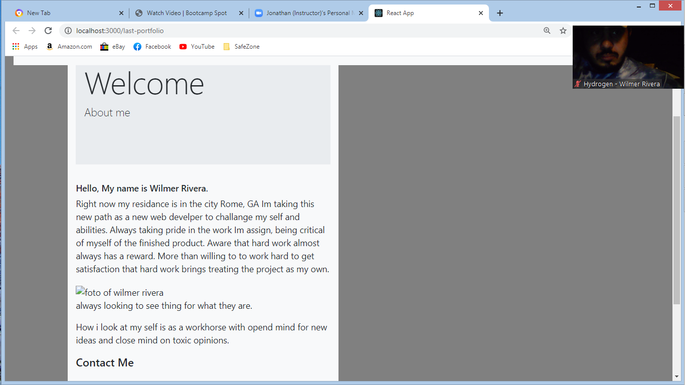

#last portfolio

A BCS asignment, was asked to use my existing portfolio with just plain html and css and turned that code in to a react app.
was able to produce one  basic about page with cantact info and links to linked in and git hub. 
when testing the page and runing npm start two windows open insted of just one.
the switch router method is broken in aplication code, most of the code is works, just a bug in my app causing the react-router-dom to cause compile isues, 

did several rebuilds without success.
was not able to display image or the navbar without breking the code, everything else work fine. 
I belive is due having the production build while doing development or just a bug

will be  continuing to go over code / or just start fresh app> 
I am able to to hit diffrent router paths in other activitys its just this app.

[this is the link to the page](https://wilmer88.github.io/last-portfolio/)
